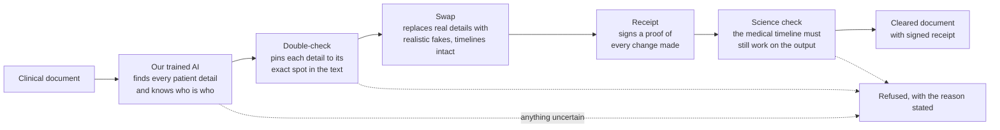

# Proxy Clinical

**We trained an AI to remove patients from clinical trial documents without removing the science that could help others. Every document our AI model clears comes with a signed receipt proving the work. Anything it can't prove safe, it refuses to sign.**

Model: [huggingface.co/vlad0717/proxy-clinical-deid-v3](https://huggingface.co/vlad0717/proxy-clinical-deid-v3) · Demo: [link] · Built at TechTown Detroit 2026

## Results

| Version | Finding identifiers* | Recognizing the same patient across a document** |
|---|---|---|
| v1: first attempt | 2.7% | 0% |
| v2: fixed the output format | 98.3% | 94.0% |
| v3: 10x the training data | 99.9% | 99.5% |

\*Did the model find each identifying detail, exactly, at its exact position (span F1).
\*\*Did it link every mention of one patient ("Robert Chen", "R. Chen", "the patient") to a single identity, without confusing two people (entity consistency).

Measured on 457 synthetic documents constructed from real clinical trial documents. The v1 to v2 jump came from a diagnosis, not more training: language models can't count characters, so we changed what we asked the model to output. Both failed runs are committed in this repo next to the passing ones.

## Why this matters in Detroit

Detroiters die of heart disease and kidney disease at twice the national rate, and of diabetes at 1.6 times it (age-adjusted, Detroit Health Department 2022-2024 vs. NCHS 2023). Which drugs work, and which harm, for people carrying those conditions is learned from clinical trial data. Today's redaction of that clinical trial data deletes exactly the fields we need to know which clinical drugs are harmful for who: age, region, and comorbidity get suppressed as "quasi-identifiers," so the subgroup signal for the populations with the heaviest burden is the first thing destroyed. Our pipeline keeps those fields intact with personal identity removed.

For the real-document test we needed a genuine clinical study report, and Health Canada is the only regulator that publishes them fully in the open: no registration, no gatekeeping, free for anyone to download. So we used a Health Canada release for finerenone, a drug for chronic kidney disease and heart complications in type 2 diabetes: public trial evidence for exactly the conditions where Detroit's burden is highest.

## What it does

Drug companies are legally required to publish clinical trial documents so independent scientists can verify safety claims (EMA Policy 0070, Health Canada PRCI). Today that means months of manual redaction per study, and the safe default is "black out more," so the published documents can't support reanalysis. When researchers finally forced access to withheld data in the past (Tamiflu, Study 329), the conclusions about efficacy and harm reversed. Patients lose twice: their data is neither fully protected nor actually used.

Proxy Clinical replaces black bars with realistic fakes. The same patient stays the same fake person on every page. Dates shift by a hidden offset so every interval survives exactly. Every processed document carries a cryptographic receipt anyone can verify offline. A final check re-runs the adverse-event timeline on the output to prove the science survived. Small enough to run entirely inside a drug company's own firewall; no patient data ever touches a cloud API.

## How it works



An independent second opinion runs after the pipeline: Microsoft Presidio, which shares no code or vocabulary with our engine, sweeps every signed output. Any personal-looking string it finds outside our labeled spans fails the document.

## What we verified and what we didn't

- The accuracy numbers above are on synthetic data our own generator produced. The model has essentially solved our benchmark; that measures the benchmark as much as the model.
- On the real Health Canada document (submission 258231, FIGARO-DKD clinical study report), results are in `docs/runs/prci-figaro/`: [N of 52] chunks signed, [N] refused with itemized reasons, hand-traced human verification of one narrative included.
- On the full synthetic end-to-end run, the pipeline signed 432 of 457 documents and refused 25. Every refusal reason is itemized in `docs/runs/`. Refusing beats guessing.
- Our first independent Presidio scan FAILED 92 documents. We inspected all 201 flagged strings by hand, wrote down four explanation patterns, and re-ran: PASS, on identical raw findings. Both scans are committed. The FAIL is part of the record.
- Mention-level de-identification cannot address uniqueness-based inference (a story so specific that someone who knows it recognizes it). No redaction engine addresses that, including ours. It's a property of what a sponsor chooses to release.
- Preserving subgroup fields is what this pipeline does; performing new subgroup analyses for Detroit populations is downstream work we have not done.
- Planned fix, not built: a v4 tokenization rule for bare numbers adjacent to dates, which caused 12 of the 25 synthetic refusals.

## Reproduce it

```bash
git clone https://github.com/vje013/proxy-clinical && cd proxy-clinical
pip install -e ".[dev]" && pytest                  # 135+ tests

# Regenerate the exact corpus (byte-identical, same seed)
python -m synthgen.cli generate --n 5000 --seed <seed in configs/scale5k.yaml> --out data/scale5k/

# Train (Colab A100, ~87 min)
bash scripts/run_pilot.sh configs/scale5k.yaml <output-dir>

# Run the pipeline and verify a receipt (no GPU needed)
python -m deid.cli run --policy policies/ema-0070-v0.yaml ...
python -m deid.cli verify <run-folder>             # offline, public key in the run folder
```

Determinism is tested, not claimed: same seed regenerates the corpus byte-identically, and the same checkpoint on the same pinned stack produces byte-identical inference output (digests in `docs/runs/*/determinism.json`).

## Provenance

Every number in this README traces to a committed record under `docs/runs/`: run manifest, config, environment freeze, data hashes, adapter hash, predictions hash, determinism digests. The hash chain runs from corpus to adapter to predictions to receipts. One run's artifacts were lost to an unsaved Colab session; its transcript is committed and labeled as a transcript, and the run was redone. A number that can't be traced isn't reported.

Real-document source: the clinical study report of the manufacturer named on the document, disclosed by Health Canada under the Public Release of Clinical Information initiative, used for non-commercial purposes under the portal's Terms of Use. The document text is intentionally absent from this repo; submission ID 258231 and our extraction tool let anyone re-derive it from the portal.

## FAQ

**Can someone reverse the fakes and find the real patients?**
No, because there is nothing to reverse. The system never stores a list matching fake names to real people. Each fake is made by a one-way scramble (real detail plus a secret key in, fake out), and the math does not run backward. Without the key, which never leaves the drug company's own servers, a fake name tells you nothing. Even we cannot undo it.

**Does the receipt leak anything?**
No. The receipt proves the work was done correctly using fingerprints (hashes) of the documents, not their contents. You can verify a receipt all day and learn nothing about any patient.

**So is re-identification impossible?**
Almost, and we are precise about the exception. If a patient's story is one of a kind, someone who already knows that story might recognize it no matter what name is on it. No redaction system can prevent that, including ours. That risk is controlled by deciding what details get published at all, and those decisions live in a public, versioned rulebook (`policies/`), not hidden inside our engine. We certify the rules were followed exactly. We do not certify the rules themselves are sufficient, and we say so.

**Why does the system refuse some documents?**
Because refusing beats guessing. If the AI's output cannot be verified at any step, the whole document is rejected with a written reason instead of being processed on a best guess. Every refusal in our runs is itemized in `docs/runs/`.

**Where does patient data go during processing?**
Nowhere. The model is small enough to run entirely inside a drug company's own firewall. No document ever touches a cloud AI service, ours or anyone's.

---

## Repo map

```
synthgen/    deterministic synthetic corpus generator
lora/        training, inference, evaluation
deid/        surrogate engine, receipts, utility check, CLI
policies/    ema-0070-v0.yaml (the published rulebook)
docs/runs/   every run's committed record, failures included
scripts/     preflight, run, packaging
```

Adapter weights: [Hugging Face](https://huggingface.co/vlad0717/proxy-clinical-deid-v3) · Devpost: [link] · License: Apache-2.0
